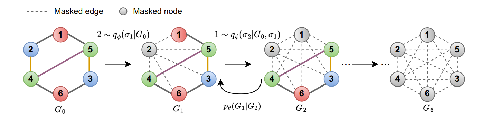
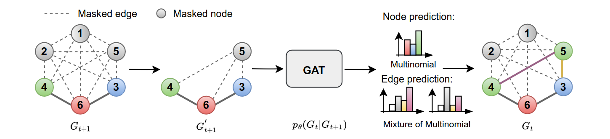

# Autoregressive Diffusion Models for Graph Generation

Unofficial implementation of the [paper from Lingkai Kong, Jiaming Cui, Haotian Sun, Yuchen Zhuang, B. Aditya Prakash, Chao Zhang](https://arxiv.org/abs/2307.08849). Autoregressive diffusion models for graph generation corrupt the original data by absorbing node by node, and then generate the graph by sampling the nodes in reverse order.

### Forward (absorbing) Diffusion Chain

In the forward diffusion chain, the model absorbs the nodes in the graph one by one, using the diffusion ordering network to model the probabilities of absorbing each node.
An absorbed node has its node features masked, and is connected to all other nodes in the graph by masked edges.



### Reverse Diffusion Chain

In the reverse diffusion chain, the model samples the nodes in the graph one by one, sampling the node to be generated based on the probabilities of the node being absorbed in the forward diffusion chain, as well as its node features.



## Installation

To install the dependencies, run 
```
pip install -r requirements.txt
```
